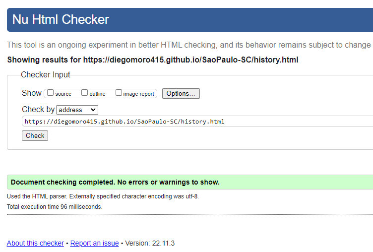

# Sao Paulo Soccer Camp
(Developer: Diego Moro)

[Live webpage](https://diegomoro415.github.io/SaoPaulo-SC/)

## Table of Content

1. [Project Goals](#project-goals)
    1. [User Goals](##user-goals)
    2. [Site Owner Goals](##site-owner-goals)
2. [User Experience](#user-experience)
    1. [Target Audience](##target-audience)
    2. [User Requrements and Expectations](##user-requirements-and-expectations)
    3. [User Stories](#user-stories)
3. [Design](#design)
    1. [Design Choices](#design-choices)
    2. [Colour](#colours)
    3. [Fonts](#fonts)
    4. [Structure](#structure)
    5. [Wireframes](#wireframes)
4. [Technologies Used](#technologies-used)
    1. [Languages](#languages)
    2. [Frameworks & Tools](#frameworks-&-tools)
5. [Features](#features)
6. [Testing](#validation)
    1. [HTML Validation](#HTML-validation)
    2. [CSS Validation](#CSS-validation)
    3. [Accessibility](#accessibility)
    4. [Performance](#performance)
    5. [Device testing](#performing-tests-on-various-devices)
    6. [Browser compatibility](#browser-compatability)
    7. [Testing user stories](#testing-user-stories)
8. [Bugs](#Bugs)
9. [Deployment](#deployment)
10. [Credits](#credits)
11. [Acknowledgements](#acknowledgements)

# Project-Goals

## User Goals
- Find a good and safe option to start practicing sport.
- Find a place that combine expert coachs and a methodology approved by a Pro Club.
- See the structure of the club.
- Find a option of course that fits better, from age, skills or gender.

## Site Owner Goals
- Increase number of students.
- Be attractive to find young stars to play for our pro team.
- Promote our Business.
- Promote our Club.

# User Experience

## Target Audience 
- Young people that are interesting to start pratice football.
- Young people that want to get to know others with the same interest and socialize.
- Young players that want to learn the technical and tactical of football.
- Talented young players that want to join to a big club that can provide a chance to became Pro.
- Parents that want a safe place to sign up their kids to practice football.

## User Requrements an Expectations
- Simple and intuitive navigation.
- Work quickly and easily.
- A good and responsive presentation.
- Find address via map contact number and links for more info.
- Accessibility.

# User Stories

### Users
1. They want to know about the methodology.
2. They want to know about the club.
3. They want to know the history of the club.
4. They want to know where is the club located.
5. They want to about the programs.
6. They want to see the successful cases.
7. They wanto to know to history of club's idols.
8. They want to see what the club can offer.
9. They want to find links to find it on social medias.
10. They want to sign-in.

### Site Owner
11. Wants to registrate users by skills, age and gender.
12. Wants to show the facilities of the club.
13. Wants users to get to know more about the history of the club.
14. Wants user to find the address.
15. Wants user to find links to more information.

# Design 

## Design Choices 
Webpage was designed with the colours of the club, divided but sections go make a easy and fast way for customers get all the relevant information going through the methodolgy, history and sign-up. 

## Colour
Club has 3 main colors so the site works on these 3 colors (Red, White and Black) also add shadow to red and dark grey to work with black. I used Coolors to find the best shade for each color.
 

## Fonts
Logo was made using Orbitron, sans-serif. 
Body was set using 'lato', sans-serif for easy read.'Orbitron', sans-serif was also used for heading sections.

## Structure
The webpage is structured in a easy to learn way. At the first the user sees The Logo on the left top of the page and a familiar type of navigation menu with the links on the right top.
the webpage contens 5 pages:
1. Home:
    - A banner with a link to SIGN-UP page.
    - Methodology presentation with a link to PROGRAMS page where user can have access to more information about the programs and the structure of the club.
    - A History briefing section with a link to HISTORY page where user can go through more information about the history of the club.
2. Program
    - At first user can find the options of programs that the club provides with a link to SIGN-UP page.
    - Facilities section where shows all the structure such as field, training center, rooms and play-ground.
    - Made to Shine is the section where shows players that started with us and became Pro players, tell about their history and contain a link to more information on wikipedia.
3. History
    - First section says from when the club was founded.
    - Greatest section shows in image and text how important was the players for the history of the club.
    - Dream Team section shows in image e text what the fans choose to be the best squad of all time and explains from the goalkeeper to the striker all titles and the history they made on the club.
4. Sign-up
    - Form where the user can be registred. it contains name, email, gender, age, nationality and they can choose what program they want to be on.
    - A google Map section, where user can see the address and contact number.

## Wireframes

<sunmmary>Home

Programs

History

Sign-Up

# Technologies Used

## Languages
- HTML
- CSS

## Frameworks & Tools
- Git
- Github
- Gitpod
- Google Fonts
- Font Awesome
- Favicon
- Coolors

# Features
The website consist in 4 pages and sixteen features.

## Logo and Navigation
- The feature is set on all 4 pages
- Navigation includes Home, Programs, History and Sign-up. 
- Responsive navbar, changes to a toggler (hamburger menu) sticky on right top on the screen.

## Home Banner
- Introduce user the idea of the page.
- Contains a button tha links to Sign-Up page.
- User stories covered: 10, 11

 

## Methodology
- Introduce user the methodology used on the programs.
- Contains a button that links to Programs page.
- User stories covered: 1

## History Briefing
- Contains a image and text.
- Introduce users to a short part of the history.
- Contains a button tha links to History page.
- User stories covered: 3, 13

## Footer
- Feature contains icon.
- Social Media links.
- User stories covered: 9, 15

## Programs
- Contains three section.
- Show and explains users the difference of category and allows user to choose.
- Contains a button tha links to Sign-Up page.
- User stories covered: 5, 10, 11

## Facilities
- Feature contains text that explain the structure that the club provide to their students.
- Contains image that show different areas that involve the structure of the club.
- User stories covered: 2, 8, 12

## Made-to-Shine
- Allows user to see the case of success
- Feature contains text and image of players that started in the club and became stars playing overseas and national team.
- User stories covered: 6

## History 
- Introduction to the history of the club.
- User stories covered: 3, 13

## Greatest
- Feature contains a image art of the greastest players.
- Text explains the connection the club has with great player form different era.
- User stories covered: 3, 13

## Dream-Team
- Feature contains a main picture that show the top 11 players voted by the fans.
- For each player there is a section with picture and text explaining to users more about them and their history while playing in the club.
- User stories covered: 3, 7, 13

## Morumbi
- At first user can read the history of the stadium (Morumbi).
- Contians six images of the stadium.
- User stories covered: 3, 13

## Support
- The feature is a homenage to the supporters.
- Contains text and four images that show the users how important the supporters are.
- User stories covered: 3, 13

## Sign-Up
- Allows user to fill your personal details.
- Users can choose what programs they want to sign in.
- User stories covered: 10, 11

## Map
- Shows the location on an embeded Google Map.
- User stories covered: 4, 14

## HTML Validation
The W3C Markup Validation Service was used to validate the HTML code of the website. All pages pass with no errors.

Home

Programs

History

Sign-Up

## CSS Validation
The W3C Jigsaw CSS Validation Service was used to validate the CSS code of the website. Page pass with no errors. 

style.css

## Performance 
Google Lighthouse in Google Chrome Developer Tools was used to test the performance of the website. 

Home

Programs

History

Sign-Up

### Performing tests on various devices 
The website was tested on the following devices:
- Alienware r3 15
- Ipad Pro
- Iphone XS

### Browser compatability
The website was tested on the following browsers:
- Google Chrome
- Microsoft Egde
- Mozilla Firefox
- Safari

## Testing user stories

1. They want to know about the methodology

| **Feature** | **Action** | **Expected Result** | **Actual Result** |
|-------------|------------|---------------------|-------------------|
| Methodology | Scroll down at home page | See methodology and a button that links user to choose a programe | Work as expected |

Screenshot

 

2. They want to know about the club.

| **Feature** | **Action** | **Expected Result** | **Actual Result** |
|-------------|------------|---------------------|-------------------|
| Facilities | Using Navbar go to programs page locate on the top of all 4 pages | Find a section with text and images showing club's facilities | Work as expected |

Screenshot

 

3. They want to know the history of the club.

| **Feature** | **Action** | **Expected Result** | **Actual Result** |
|-------------|------------|---------------------|-------------------|
| History | Using Navbar go to History page locate on right top of all 4 pages | a page dedicate to tell the club's history | Work as expected |

Screenshot

4. They want to know where is the club located.

| **Feature** | **Action** | **Expected Result** | **Actual Result** |
|-------------|------------|---------------------|-------------------|
| Map | Located below the form on sign-up page | locate the google map showing the location of the soccer camp | Work as expected |

Screenshot

5. They want to about the programs.

| **Feature** | **Action** | **Expected Result** | **Actual Result** |
|-------------|------------|---------------------|-------------------|
| Programs | Using Navbar go to programs page locate on right top of all 4 pages | Find three table with three different programs and waht they can offer | Work as expected |

Screenshot

6. They want to see the successful cases.

| **Feature** | **Action** | **Expected Result** | **Actual Result** |
|-------------|------------|---------------------|-------------------|
| Made To Shine | on programs page below programs table and our facilities | Find a section with text and images showing pro player that started playing with us  | Work as expected |

Screenshot

7. They want to know to history of club's idols.

| **Feature** | **Action** | **Expected Result** | **Actual Result** |
|-------------|------------|---------------------|-------------------|
| Dream Team | Using Navbar on history page scroll down | A section with the top 11 of all time and their hisotry in the club | Work as expected |

Screenshot

8. They want to see what the club can offer.

| **Feature** | **Action** | **Expected Result** | **Actual Result** |
|-------------|------------|---------------------|-------------------|
| Facilities | Navbar programs page locate on rith top of all 4 pages | Find a program see all structure of the club | Work as expected |

Screenshot

9. They want to find links to find it on social medias.

| **Feature** | **Action** | **Expected Result** | **Actual Result** |
|-------------|------------|---------------------|-------------------|
| Footer | locate on the bottom of all 4 pages | Find links to all club's social midias | Work as expected |

Screenshot

10. They want to sign-in.

| **Feature** | **Action** | **Expected Result** | **Actual Result** |
|-------------|------------|---------------------|-------------------|
| Sign Up Form | Using Navbar, sign-up page locate on rith top of all 4 pages | Find a form to sign in to the program the user chose | Work as expected |
| Home Banner | click on the button "sign-up" |  Find a form to sign in to the program the user chose | Work as expected |
| Programs | click on the button "sign-up" | Find a form to sign in to the program the user chose | Work as expected |

Screenshot

Screenshot

Screenshot

11. Wants to registrate users by skills, age and gender.

| **Feature** | **Action** | **Expected Result** | **Actual Result** |
|-------------|------------|---------------------|-------------------|
| Home Banner | click on the button "sign-up" |  Find a form to sign in to the program the user chose | Work as expected |
| Programs | click on the button "sign-up" | Find a form to sign in to the program the user chose | Work as expected |
| Sign Up Form | Using Navbar, sign-up page locate on rith top of all 4 pages | Find a form to sign in to the program the user chose | Work as expected |

Screenshot

12. Wants to show the facilities of the club.

| **Feature** | **Action** | **Expected Result** | **Actual Result** |
|-------------|------------|---------------------|-------------------|
| Facilities | Using Navbar go to programs page locate on rith top of all 4 pages | Find a section with text and images showing club's facilities | Work as expected |

Screenshot

13. Wants users to get to know more about the history of the club.

| **Feature** | **Action** | **Expected Result** | **Actual Result** |
|-------------|------------|---------------------|-------------------|
| History | Using Navbar go to History page locate on rith top of all 4 pages | a page dedicate to tell the club's history | Work as expected |

Screenshot

14. Wants user to find the address.

| **Feature** | **Action** | **Expected Result** | **Actual Result** |
|-------------|------------|---------------------|-------------------|
| Map | Located below the form on sign-up page | locate the google map showing the location of the soccer camp | Work as expected |

Screenshot

15. Wants user to find links to more information.

| **Feature** | **Action** | **Expected Result** | **Actual Result** |
|-------------|------------|---------------------|-------------------|
| Footer | locate on the bottom of all 4 pages | Find links to all club's social midias | Work as expected |

Screenshot

## Deployment
The website was deployed using GitHub Pages by following these steps:
1. In the GitHub repository navigate to the Settings tab
2. On the left hand menu select Pages
3. For the source select Branch: master
4. After the webpage refreshes automaticaly you will se a ribbon on the top saying: "Your site is live at "https://diegomoro415.github.io/SaoPaulo-SC/"

You can for fork the repository by following these steps:
1. Go to the GitHub repository
2. Click on Fork button in upper right hand corner

You can clone the repository by following these steps:
1. Go to the GitHub repository 
2. Locate the Code button above the list of files and click it 
3. Select if you prefere to clone using HTTPS, SSH, or Github CLI and click the copy button to copy the URL to your clipboard
4. Open Git Bash
5. Change the current working directory to the one where you want the cloned directory
6. Type git clone and paste the URL from the clipboard ($ git clone https://github.com/YOUR-USERNAME/YOUR-REPOSITORY)
7.Press Enter to create your local clone.

## Credits
Images not referenced below are owned by the developer.

### Media
In order of apearance:
- [Home-Banner](/assets/image/banner.webp): Photo by <a href="https://spfccampinas.com.br/spfc/">Sao Paulo Campinas</a>
- [Methodology](/assets/image/meth_image.webp): Photo by <a href="https://www.behance.net/gallery/141550309/-Flyer-Esportivo-%28Sao-Paulo-FC%29?tracking_source=search_projects%7CS%C3%A3o+Paulo+FC">Behance</a>
- [History-Briefing](/assets/image/rogerio_ceni_club_world_cup.webp): Photo by <a href="https://www.google.com/url?sa=i&url=https%3A%2F%2Fbiggo.com.br%2Fs%2Frog%25C3%25A9rio%2520ceni%25202005%2F&psig=AOvVaw2OXktU7gU0KXcBSob6_Dat&ust=1669057580240000&source=images&cd=vfe&ved=0CBAQjRxqFwoTCOj2ppO6vfsCFQAAAAAdAAAAABAK">Dreams Time</a>
- [Programs](/assets/image/academy_image.webp): Photo by 
- [Programs](/assets/image/student_image.webp): Photo by <a href="https://sharpshotsphotoclub.co.uk/wp-content/uploads/2016/06/Joe-Farace-300x202.png">Sharp Shots Photo Club</a>
- [Programs](/assets/image/competition_image.webp): Photo by <a href="https://cdn11.bigcommerce.com/s-y4zh7fy1wn/images/stencil/1280w/uploaded_images/adobestock-79564108.jpeg?t=1556917326">Bigcommerce</a>
- [Facilities](/assets/image/training_center.webp): Photo by <a href="https://www.google.com/url?sa=i&url=https%3A%2F%2Fwww.lance.com.br%2Fsao-paulo%2Fsao-paulo-abre-inscricoes-para-visita-guiada-ao-ct-de-cotia-veja-precos-e-como-comprar.html&psig=AOvVaw3tCcartx11NXZGq1O4pF-u&ust=1669058143038000&source=images&cd=vfe&ved=0CBAQjRxqFwoTCLjszJ-8vfsCFQAAAAAdAAAAABAE">o Lance</a>
- [Facilities](/assets/image/campus_cotia.webp): Photo by <a href="https://www.google.com/url?sa=i&url=http%3A%2F%2Fwww.saopaulofc.net%2Festrutura%2Fcfa-cotia&psig=AOvVaw3tCcartx11NXZGq1O4pF-u&ust=1669058143038000&source=images&cd=vfe&ved=0CBAQjRxqFwoTCLjszJ-8vfsCFQAAAAAdAAAAABAO">Sao Paulo FC</a>
- [Facilities](/assets/image/accomodation.webp): Photo by <a href="https://www.google.com/url?sa=i&url=http%3A%2F%2Fwww.saopaulofc.net%2Festrutura%2Fcfa-cotia&psig=AOvVaw3tCcartx11NXZGq1O4pF-u&ust=1669058143038000&source=images&cd=vfe&ved=0CBAQjRxqFwoTCLjszJ-8vfsCFQAAAAAdAAAAABAJ">Sao Paulo FC</a>
- [Facilities](/assets/image/accomodation_room.webp): Photo by <a href="https://www.google.com/url?sa=i&url=http%3A%2F%2Fwww.saopaulofc.net%2Festrutura%2Fcfa-cotia&psig=AOvVaw3tCcartx11NXZGq1O4pF-u&ust=1669058143038000&source=images&cd=vfe&ved=0CBAQjRxqFwoTCLjszJ-8vfsCFQAAAAAdAAAAABAT">Sao Paulo FC</a>
- [Facilities](/assets/image/play_room.webp): Photo by <a href="https://www.google.com/url?sa=i&url=http%3A%2F%2Fwww.saopaulofc.net%2Festrutura%2Fcfa-cotia&psig=AOvVaw3tCcartx11NXZGq1O4pF-u&ust=1669058143038000&source=images&cd=vfe&ved=0CBAQjRxqFwoTCLjszJ-8vfsCFQAAAAAdAAAAABAY">Sao Paulo FC</a>
- [Facilities](/assets/image/girls_in_cotia.webp): Photo by <a href="https://scontent-cph2-1.xx.fbcdn.net/v/t1.6435-9/119169948_3090607404383850_5916472444075543977_n.jpg?_nc_cat=111&ccb=1-7&_nc_sid=8bfeb9&_nc_ohc=nT7b17zc-8cAX-vmd1t&_nc_ht=scontent-cph2-1.xx&oh=00_AfDGLsPKCEHrgtgb-hECMTwF5vdmHoZ0RSo0xIoznX6VbA&oe=63A1E6F6">Sao Paulo FC</a>
- [Facilities](/assets/image/kids_on_stadium.webp): Photo by <a href="http://media2.saopaulofc.net/media/46465/9400_crop_galeria.jpg">Sao Paulo FC</a>
- [Made-to-Shine](/assets/image/kaka.webp): Photo by <a href="https://www.google.com/url?sa=i&url=https%3A%2F%2Ftwitter.com%2FSaoPauloFC%2Fstatus%2F1385212576884305928&psig=AOvVaw1ZTsrV1BU4YCRZjUTikcja&ust=1669058111227000&source=images&cd=vfe&ved=0CBAQjRxqFwoTCNCku5C8vfsCFQAAAAAdAAAAABAE">Sao Paulo FC</a>
- [Made-to-Shine](/assets/image/casemiro.webp): Photo by <a href="https://www.google.com/url?sa=i&url=https%3A%2F%2Fas.com%2Ffutbol%2Falbum%2Fla-trayectoria-de-casmiro-una-leyenda-madridista-f%2F&psig=AOvVaw3ifhj6HtbBbcWuyMain_Hk&ust=1669058085229000&source=images&cd=vfe&ved=0CBAQjRxqFwoTCPj4h4S8vfsCFQAAAAAdAAAAABAF">2F Futbol</a>
- [Made-to-Shine](/assets/image/lucas.webp): Photo by <a href="https://www.google.com/url?sa=i&url=https%3A%2F%2Fbleacherreport.com%2Farticles%2F1266035-sao-paulo-united-need-to-offer-a-little-more-to-sign-lucas-moura&psig=AOvVaw13VEWQeXXKL4qbQfZT2_TI&ust=1669058066909000&source=images&cd=vfe&ved=0CBAQjRxqFwoTCLDyrPu7vfsCFQAAAAAdAAAAABAEhttps://www.google.com/url?sa=i&url=https%3A%2F%2Fbleacherreport.com%2Farticles%2F1266035-sao-paulo-united-need-to-offer-a-little-more-to-sign-lucas-moura&psig=AOvVaw13VEWQeXXKL4qbQfZT2_TI&ust=1669058066909000&source=images&cd=vfe&ved=0CBAQjRxqFwoTCLDyrPu7vfsCFQAAAAAdAAAAABAE">Farticles</a>
- [Made-to-Shine](/assets/image/antony.webp): Photo by <a href="https://www.google.com/url?sa=i&url=https%3A%2F%2Fwww.transfermarkt.com%2Fajax-sign-antony-from-sao-paulo-most-expensive-signing-in-eredivisie-history%2Fview%2Fnews%2F354964&psig=AOvVaw0acRXxYZy2Mx_SLbCI9JL6&ust=1669058014122000&source=images&cd=vfe&ved=0CBAQjRxqFwoTCIC9keK7vfsCFQAAAAAdAAAAABAE">Transfermarkt</a>
- [History](/assets/image/titles.webp): Photo by <a href="https://www.google.com/url?sa=i&url=https%3A%2F%2Fwww.arqtricolor.com%2Ftitulos-do-sao-paulo-fc%2F&psig=AOvVaw0mgpq3b8wCJwze6HvBzv9C&ust=1669058035913000&source=images&cd=vfe&ved=0CBAQjRxqFwoTCMCLwuy7vfsCFQAAAAAdAAAAABAE">Sao Paulo FC</a>
- [Greatest](/assets/image/greatest.webp): Photo by <a href="https://www.google.com/url?sa=i&url=https%3A%2F%2Fwww.facebook.com%2Fsaopaulo1234%2F&psig=AOvVaw1ssMkYOx3cl9WvALveXpXo&ust=1669053409544000&source=images&cd=vfe&ved=0CBAQjRxqFwoTCIC4wc6qvfsCFQAAAAAdAAAAABAp">Sao Paulo FC</a>
- [Dream-Team-image](/assets/image/dream_team.webp): Photo by <a href="https://www.google.com/url?sa=i&url=https%3A%2F%2Fimortaisdofutebol.com%2Ftime-dos-sonhos-do-sao-paulo%2F&psig=AOvVaw1ssMkYOx3cl9WvALveXpXo&ust=1669053409544000&source=images&cd=vfe&ved=0CBAQjRxqFwoTCIC4wc6qvfsCFQAAAAAdAAAAABAQ">Imortais do Futebol</a>
- [Dream-Team](/assets/image/cafu.webp): Photo by <a href="https://www.google.com/url?sa=i&url=https%3A%2F%2Fspfcnoticias.com%2Fcafu-revela-que-sempre-foi-torcedor-do-sao-paulo%2F&psig=AOvVaw18GxeNYo5mu2JBmGljf6Ob&ust=1669057992293000&source=images&cd=vfe&ved=0CBAQjRxqFwoTCIjd3te7vfsCFQAAAAAdAAAAABAE">SPFC Noticias</a>
- [Dream-Team](/assets/image/dario_pereyra.webp): Photo by <a href="https://img.r7.com/images/dario-pereyra-ex-zagueiro-e-o-uruguaio-que-mais-jogou-pelo-sao-paulo-453-partidas-e-37-gols-atuou-no-clube-de-1977-a-1988-e-conquistou-quatro-paulistas-e-dois-brasileiros-15042020074331662?dimensions=771x420&no_crop=true?dimensions=771x420&no_crop=true">R7</a>
- [Dream-Team](/assets/image/lugano.webp): Photo by <a href="https://www.google.com/url?sa=i&url=http%3A%2F%2Fwww.saopaulofc.net%2Fnoticias%2Fnoticias%2Ffutebol%2F2016%2F1%2F18%2Frespeito-e-amor-pela-camisa-tricolor!&psig=AOvVaw1Uy1Ner5ae1dWAKKamSftC&ust=1669057969282000&source=images&cd=vfe&ved=0CBAQjRxqFwoTCJiX3cy7vfsCFQAAAAAdAAAAABAE">Sao Paulo FC</a>
- [Dream-Team](/assets/image/leonardo.webp): Photo by <a href="https://www.google.com/url?sa=i&url=https%3A%2F%2Fwww.gazetaesportiva.com%2Ftimes%2Fsao-paulo%2Frelembre-5-grandes-partidas-de-leonardo-com-a-camisa-do-sao-paulo%2F&psig=AOvVaw3StJylDQQnwNJ_wBi3VK0o&ust=1669057917432000&source=images&cd=vfe&ved=0CBAQjRxqFwoTCOiPhrS7vfsCFQAAAAAdAAAAABAE">Gazeta Esportiva</a>
- [Dream-Team](/assets/image/mineiro.png): Photo by <a href="https://www.google.com/url?sa=i&url=https%3A%2F%2Fwww.arqtricolor.com%2Fultimas%2Fautor-do-gol-do-titulo-mundial-em-2005-mineiro-esta-ha-14-anos-morando-fora-do-brasil%2F&psig=AOvVaw1uBQu_VvNOSS5Bl2Acudz5&ust=1669057880286000&source=images&cd=vfe&ved=0CBAQjRxqFwoTCKiKqaK7vfsCFQAAAAAdAAAAABAE">Arq Tricolor</a>
- [Dream-Team](/assets/image/pedro_rocha.webp): Photo by <a href="https://www.google.com/url?sa=i&url=https%3A%2F%2Ftwitter.com%2Fsaopaulofc%2Fstatus%2F1007598156148891648&psig=AOvVaw1ssMkYOx3cl9WvALveXpXo&ust=1669053409544000&source=images&cd=vfe&ved=0CBAQjRxqFwoTCIC4wc6qvfsCFQAAAAAdAAAAABAa">Sao Paulo FC</a>
- [Dream-Team](/assets/image/muller.webp): Photo by <a href="https://www.google.com/url?sa=i&url=https%3A%2F%2Frecordtv.r7.com%2Ffotos%2Frelembre-a-carreira-vitoriosa-de-muller-nos-gramados-do-brasil-e-do-mundo-09022022&psig=AOvVaw2s_gXaJYT9AN76Ziuaepx1&ust=1669057815370000&source=images&cd=vfe&ved=0CBAQjRxqFwoTCOiXw4O7vfsCFQAAAAAdAAAAABAJ">R7</a>
- [Dream-Team](/assets/image/leonidas.jpg): Photo by <a href="https://www.google.com/url?sa=i&url=https%3A%2F%2Fwww.besthomenagens.com.br%2Fhomenageamos-hoje-leonidas-da-silva%2F&psig=AOvVaw0DTkKOOoGO8NNar64flRyz&ust=1669057792268000&source=images&cd=vfe&ved=0CBAQjRxqFwoTCNC1s_i6vfsCFQAAAAAdAAAAABAE">Best Homenagens</a>
- [Dream-Team](/assets/image/careca.webp): Photo by <a href="https://www.google.com/url?sa=i&url=https%3A%2F%2Fwww.terra.com.br%2Fesportes%2Fparceiro-de-maradona-e-idolo-do-sao-paulo-careca-assina-acordo-para-ser-comentarista-esportivo%2Cc99660237efaa9cabef5f1bbce1d51d90pkr89i8.html&psig=AOvVaw2qJs57TrVx2NKIgIPIl6I5&ust=1669057753487000&source=images&cd=vfe&ved=0CBAQjRxqFwoTCPjs8eW6vfsCFQAAAAAdAAAAABAE">Terra</a>
- [Dream-Team](/assets/image/rai.png): Photo by <a href="https://www.google.com/url?sa=i&url=https%3A%2F%2Fesportefera.com.br%2Fnoticias%2Ffutebol%2Crai-volta-ao-sao-paulo-relembre-a-carreira-do-terror-do-morumbi%2C70002113270&psig=AOvVaw2ZMSj_RR9qaTnv9sih_mIH&ust=1669057848875000&source=images&cd=vfe&ved=0CBAQjRxqFwoTCKDSsZO7vfsCFQAAAAAdAAAAABAE">Fesportefera</a>
- [Dream-Team](/assets/image/tele_santana.webp): Photo by <a href="https://www.google.com/url?sa=i&url=https%3A%2F%2Ftwitter.com%2Fsaopaulofc%2Fstatus%2F1551905211085733888&psig=AOvVaw18U3fnm9Qp_Ot7E-HwVJ7i&ust=1669057435214000&source=images&cd=vfe&ved=0CBAQjRxqFwoTCLCgkM65vfsCFQAAAAAdAAAAABAE">Sao Paulo Twitter</a>
- [404-error](/assets/image/red_card.jpg): Photo by <a href="https://m.media-amazon.com/images/I/41fqscXfUKL._AC_SY1000_.jpg">Media Amazon</a>

## Code
In order of apearance:
- The HTML for the responsive [Navbar with toggler](https://alvarotrigo.com/blog/hamburger-menu-css/) 

## Acknowledgements
I would like to take the opportunity to thank:
- My mentor Mo Shami for his feedback, advice, guidance and support.
- To my colleagues in Code Institute Slack for sharing sharing knowlogde and give support.